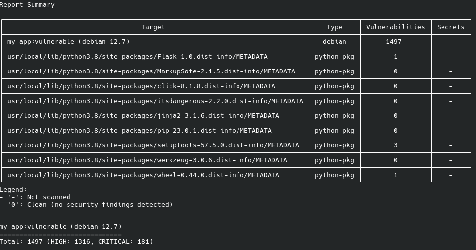
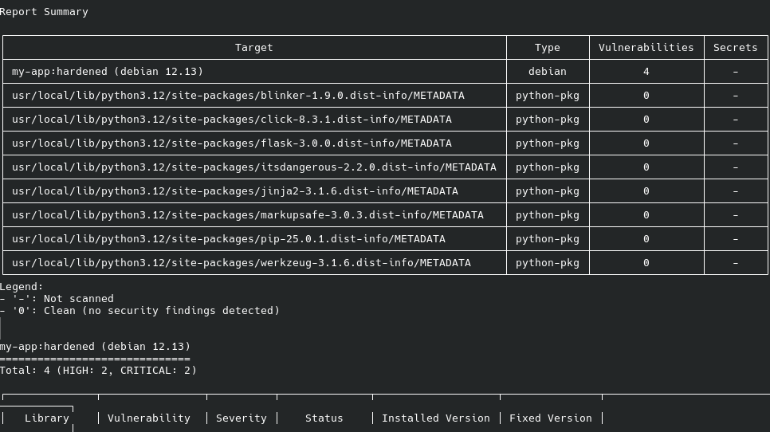

# Lab 2: Container Security & Policy Enforcement

Detta projekt demonstrerar hur man säkrar en containeriserad Python-applikation genom sårbarhetsskanning, "hardening" av Docker-images och användning av Policy-as-Code i Kubernetes.

## 🛠 Verktyg & Tekniker
* **Docker**: För containerisering av applikationen.
* **Trivy**: För skanning av sårbarheter (CVE:er) och generering av SBOM.
* **Flask**: En lättvikts-webbapplikation för testning.
* **OPA/Gatekeeper**: För att styra och neka osäkra resurser i Kubernetes.
* **CycloneDX**: Standardformat för Software Bill of Materials (SBOM).

---

## 🛡️ Del 1: Image Hardening (Trivy)

Jag skapade först en vulnerable Dockerfile (`Dockerfile.vulnerable`) och skapade sedan en säker version (`Dockerfile.hardened`).

### Förändringar för ökad säkerhet:
1. **Bas-image**: Bytt från `python:3.8` till `python:3.12-slim-bookworm` för att minimera attackytan.
2. **Privilegier**: Implementerat en **non-root user** (`appuser`). Applikationen körs inte längre som root, vilket förhindrar "container breakout"-attacker.
3. **Optimering**: Använt `--no-cache-dir` för att hålla imagen liten och ren.
4. **Hälso-check**: Lagt till `HEALTHCHECK` för att säkerställa driften.
5. **Patchning**: Uppdaterat Flask från 1.0.0 till 3.0.0 för att åtgärda kända säkerhetshål.

### Resultat av skanning
| Version | Status | Kommentar |
| :--- | :--- | :--- |
| **Vulnerable** | 🔴 5 High | Innehöll allvarliga sårbarheter i Flask och bas-paketen. |
| **Hardened** | 🟢 0 High/Critical | Alla kritiska sårbarheter åtgärdade genom patchning och slim-image. |

#### Skärmklipp från skanningar:
**Före hardening:**

**Efter hardening:**

---

## 📦 Del 2: SBOM (Software Bill of Materials)

Jag har genererat en `sbom.json` i CycloneDX-format för att få full transparens över alla beroenden.
* **Varför?** SBOM är avgörande för att snabbt kunna svara på nya CVE:er och för att följa regleringar som EU Cyber Resilience Act.
* **Innehåll**: Min image innehåller totalt **116 komponenter**.

---

## ⚓ Del 3: Kubernetes Policy Enforcement (Gatekeeper)

För att säkerställa att inga "osäkra" resurser deployas i klustret har jag implementerat **Gatekeeper**.

### Implementerad Policy: `Require Labels`
Jag skapade en `ConstraintTemplate` och en `Constraint` som tvingar alla Pods i namesp

## Reflektioner

Container-säkerhet handlar om att minimera attackytan. Genom att byta till en "slim"-image och köra som non-root (appuser) har jag tagit bort hundratals onödiga sårbarheter och sett till att en eventuell angripare inte får kontroll över host-systemet. Det handlar om att bygga säkert från grunden istället för att bara hoppas på det bästa.

SBOM är som en innehållsförteckning för min mjukvara. Det är kritiskt för "Supply Chain Security" eftersom jag på några sekunder kan se exakt vilka paket som körs. Jag tänkte aldrig på det för mycket, men har gjort min egen version av en SBOM under praktik tidigare då jag behövde göra en hel inventering för att de inte hade det. SBOM verkar underlätta det också. Och om en ny sårbarhet (CVE) dyker upp imorgon behöver jag inte gissa – jag har dokumentationen redo direkt, vilket sparar veckor av manuellt arbete.

Gatekeeper ändrar arbetssättet i Kubernetes genom "Policy as Code". Istället för att rätta fel i efterhand fungerar det som en digital dörrvakt (Admission Controller) som stoppar osäkra resurser innan de ens deployas. Det skapar trygga ramar för utvecklare och automatiserar säkerheten på ett sätt som gör klustret mer robust över tid.
